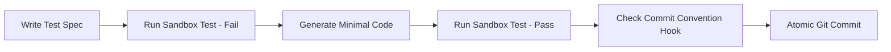

# Agentic-Init (`ainit`) Execution Rules

## General Principles
1. **Atomic Micro-Commits**: All generated code must be committed in small, single-purpose commits.
2. **Commit Convention Compliance**: Every commit message MUST strictly adhere to the configured Commit Convention (e.g. Conventional Commits or Gitmoji).
3. **PR Convention Compliance**: Every Pull Request MUST follow the generated PR template and satisfy all checklist criteria.
4. **TDD First**: Write failing test specifications prior to writing feature code.
5. **Local Sandbox Verification**: Execute build & test suites locally before executing git commit.
6. **Documentation Sync**: Keep Notion and Confluence documentation up-to-date via MCP integrations.

## Workflow Rules

