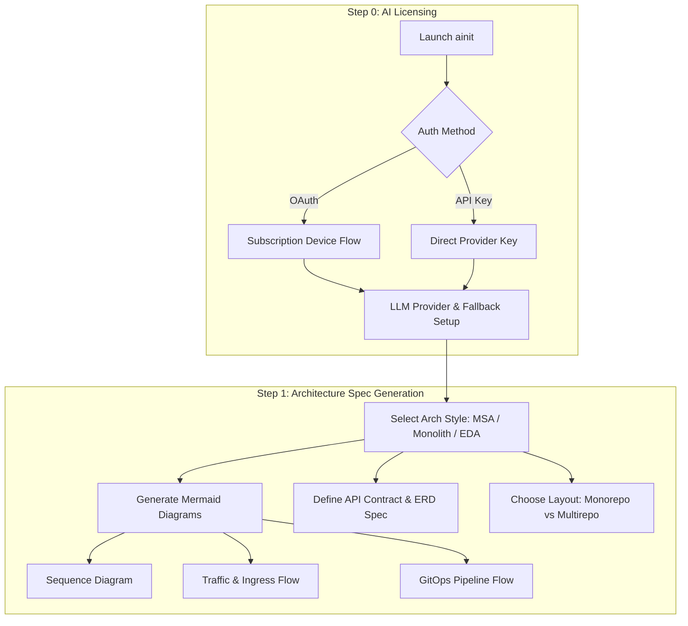
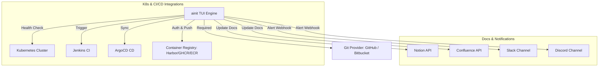
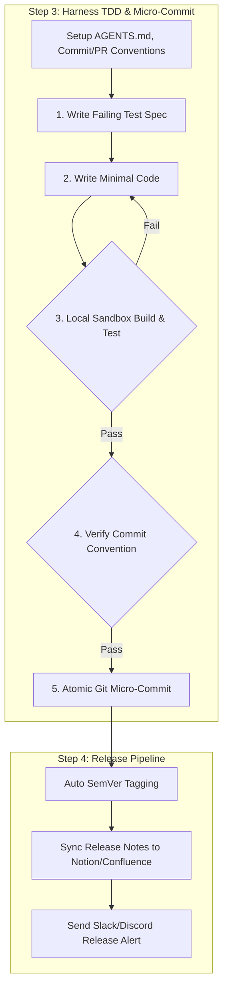

# Agentic-Init (`ainit`)

> Interactive TUI Harness Engineering Tool for Project Initialization, Architecture Design, Commit/PR Conventions, and Automated Release Pipeline.

[](LICENSE)
[](https://go.dev/)

---

## 🚀 Overview

**Agentic-Init (`ainit`)**은 프로젝트의 **Initialization(초기 설계)**부터 **Release(상용 배포)**까지의 전체 개발 생애주기를 관장하는 CLI/TUI 하네스 엔지니어링 도구입니다.

- **바이너리 커맨드 명**: `ainit`

---

## 🛠️ Build & Installation Guide (빌드 및 설치 방법)

### Prerequisites (사전 요구사항)
- **Go**: `1.21` 버전 이상 설치 필요 ([Go 설치 가이드](https://go.dev/doc/install))

### 1. Repository Clone (저장소 복사)
```bash
git clone https://github.com/myeong-han/ainit.git
cd ainit
```

### 2. Dependency Tidy (의존성 동기화)
```bash
go mod tidy
```

### 3. Build Binary (바이너리 빌드)
```bash
# bin/ainit 바이너리 빌드
go build -o bin/ainit ./cmd/ainit
```

### 4. Run TUI (TUI 도구 실행)
```bash
# 빌드된 바이너리 직접 실행
./bin/ainit

# 또는 go run을 통해 소스에서 직접 실행
go run ./cmd/ainit
```

### 5. Install to System Path (시스템 글로벌 설치 - 선택사항)
```bash
# $GOPATH/bin 위치에 ainit 커맨드로 등록
go install ./cmd/ainit

# 이제 어디서든 ainit 실행 가능
ainit
```

### 6. Run Unit Tests (단위 테스트 실행)
```bash
go test -v ./...
```

---

## 📋 System Architecture Diagrams

### 1. Overall 5-Step Pipeline Overview


### 2. Step 0 & 1: AI Licensing & Architecture Spec Flow


### 3. Step 2: MCP & Infrastructure Tooling Topology


### 4. Step 3 & 4: Harness TDD Loop & Release Pipeline


---

## 📄 Documentation

- [Architecture Design Specification](docs/ARCHITECTURE.md)
- [TUI Questionnaire Form Specification](docs/QUESTIONNAIRE_SPEC.md)

---

> Maintained by **myeong-han**
