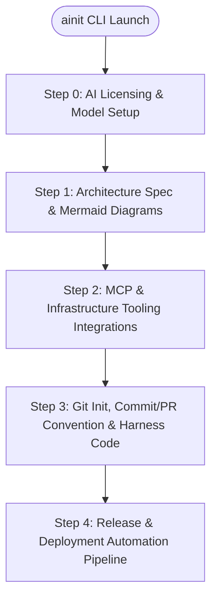

# Agentic-Init (`ainit`)

> Interactive TUI Harness Engineering Tool for Project Initialization, Architecture Design, Commit/PR Conventions, and Automated Release Pipeline.

[](https://app.notion.com/p/3a7267e15cd0819e84c0f23b71fd0b8c)
[](LICENSE)

---

## 🚀 Overview

**Agentic-Init (`ainit`)**은 프로젝트의 **Initialization(초기 설계)**부터 **Release(상용 배포)**까지의 전체 개발 생애주기를 관장하는 CLI/TUI 하네스 엔지니어링 도구입니다.

- **바이너리 커맨드 명**: `ainit`
- **노션 설계서**: [project/personal/ainit](https://app.notion.com/p/3a7267e15cd0819e84c0f23b71fd0b8c)

---

## 📋 Key Features & TUI Pipeline



### 1. Step 0: AI Licensing & Model Setup
- **Subscription (OAuth)**: OpenCode compatible Device Flow support.
- **Direct API Keys**: Anthropic (Claude 3.5 Sonnet), OpenAI (GPT-4o), Google (Gemini Pro/Flash).
- **Cost & Token Tracker**: Real-time token usage and cost monitoring per session.

### 2. Step 1: Architecture & Program Spec Generation (.md)
- **Architecture Styles**: MSA (Microservices) / Modular Monolith / Event-Driven Architecture.
- **Mermaid Diagrams**: Sequence Diagrams, Traffic Flow, Security & Auth Flow, GitOps Flow.
- **API Spec & ERD**: OpenAPI 3.0 / AsyncAPI schemas and Mermaid ERD generation.
- **Repo Layout**: Monorepo (pnpm/go workspace) vs Multirepo strategy.

### 3. Step 2: MCP Connections & Tooling Management
- **Git Provider (Required)**: GitHub & Bitbucket integration.
- **Infrastructure (Optional)**: Kubernetes Cluster health check (`kubectl` / remote kubeconfig).
- **CI/CD Pipeline (Optional)**: Jenkins CI & ArgoCD GitOps deployment.
- **Container Registry (Optional)**: Harbor / GHCR / ECR / Docker Hub.
- **Docs & Messenger (Optional)**: Notion API, Confluence, Slack Webhook, Discord Webhook.

### 4. Step 3: Git Initialization & Commit/PR Conventions
- **Agent Rules**: Auto-generation of `AGENTS.md`, `CLAUDE.md`, `.cursorrules`.
- **Commit Conventions**: Conventional Commits, Gitmoji, Issue Key Prefixes, or Custom Patterns.
- **PR Conventions**: Auto PR Template, Checklist generation, Auto-labeling rules.
- **TDD & Sandbox Verification**: Local build and unit test verification prior to git commits.

### 5. Step 4: Release & Deployment Automation
- **SemVer Versioning**: Automatic Major.Minor.Patch tagging.
- **Auto Release Notes**: Notion & Confluence page updates upon release.
- **Notifications**: Slack / Discord deployment alert webhooks.

---

## 📦 Installation & Usage

```bash
# Clone the repository
git clone https://github.com/myeong-han/ainit.git
cd ainit

# Run the TUI Harness Engine
ainit
```

---

## 📄 Documentation

- [Architecture Design Specification](docs/ARCHITECTURE.md)
- [TUI Questionnaire Form Specification](docs/QUESTIONNAIRE_SPEC.md)
- [Notion Living Spec](https://app.notion.com/p/3a7267e15cd0819e84c0f23b71fd0b8c)

---

> Maintained by **myeong-han**
