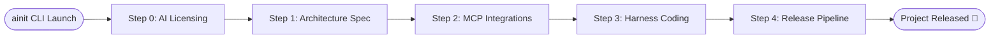
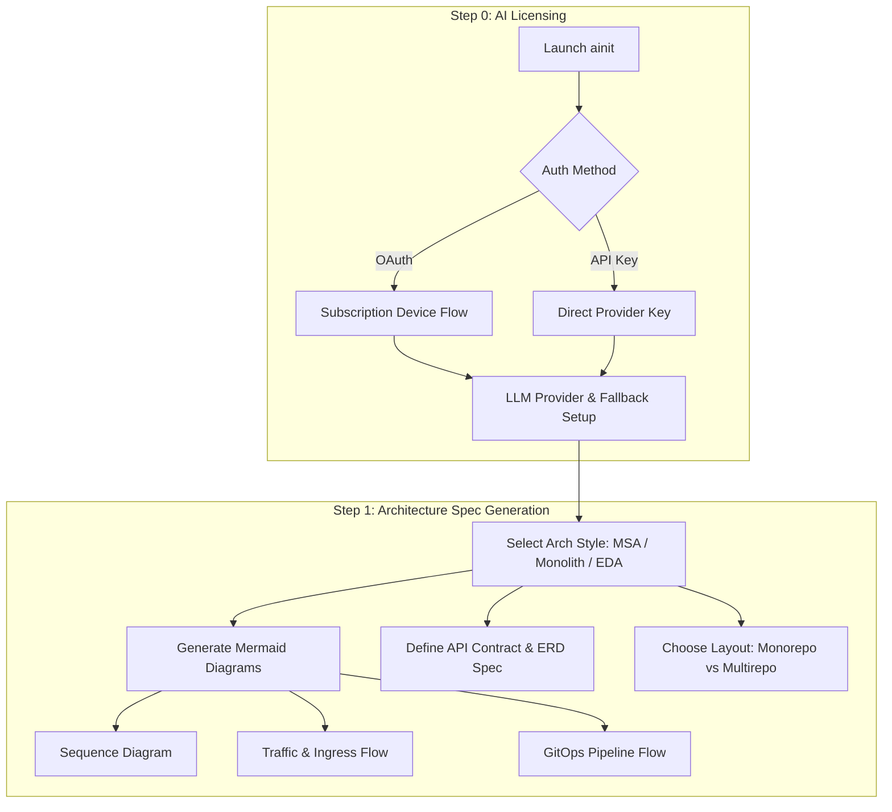
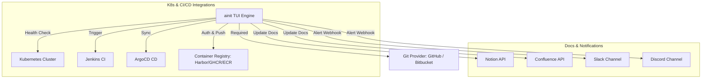
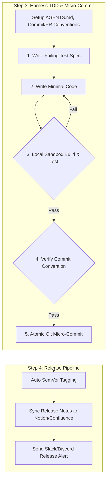

# Agentic-Init (`ainit`)

> Interactive TUI Harness Engineering Tool for Project Initialization, Architecture Design, Commit/PR Conventions, and Automated Release Pipeline.

[](LICENSE)

---

## 🚀 Overview

**Agentic-Init (`ainit`)**은 프로젝트의 **Initialization(초기 설계)**부터 **Release(상용 배포)**까지의 전체 개발 생애주기를 관장하는 CLI/TUI 하네스 엔지니어링 도구입니다.

- **바이너리 커맨드 명**: `ainit`

---

## 📋 System Architecture Diagrams

### 1. Overall 5-Step Pipeline Overview


### 2. Step 0 & 1: AI Licensing & Architecture Spec Flow


### 3. Step 2: MCP & Infrastructure Tooling Topology


### 4. Step 3 & 4: Harness TDD Loop & Release Pipeline


---

## 📦 Installation & Usage

```bash
# Clone the repository
git clone https://github.com/myeong-han/ainit.git
cd ainit

# Run the TUI Harness Engine
ainit
```

---

## 📄 Documentation

- [Architecture Design Specification](docs/ARCHITECTURE.md)
- [TUI Questionnaire Form Specification](docs/QUESTIONNAIRE_SPEC.md)

---

> Maintained by **myeong-han**
