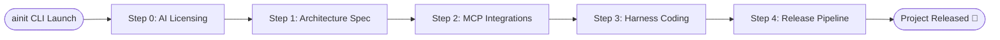
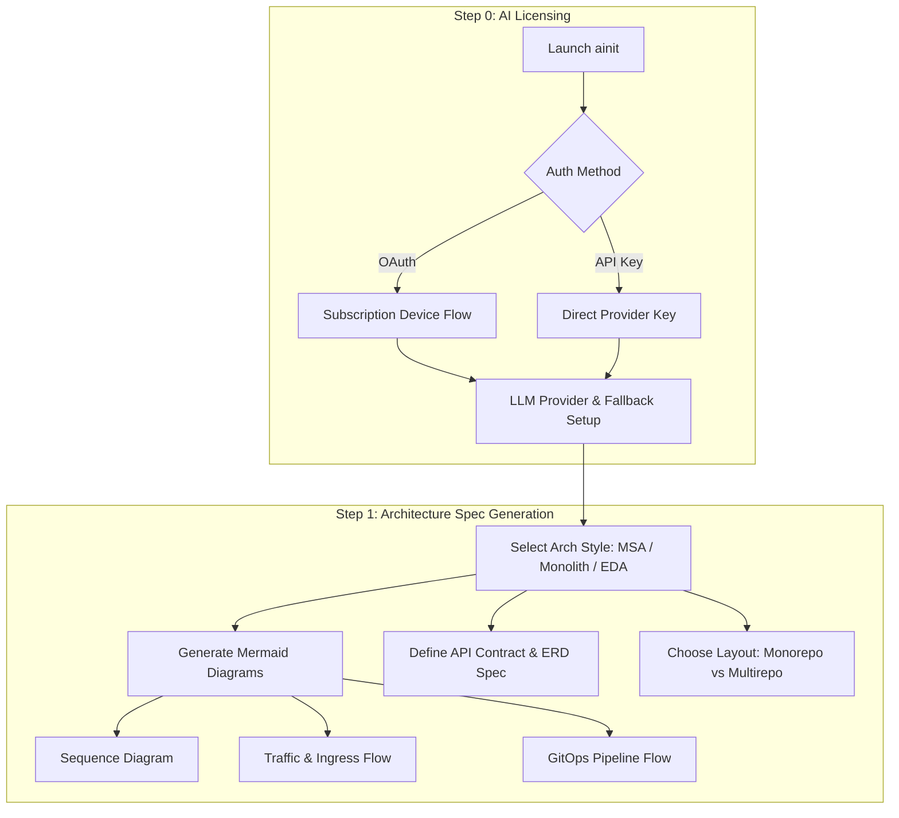
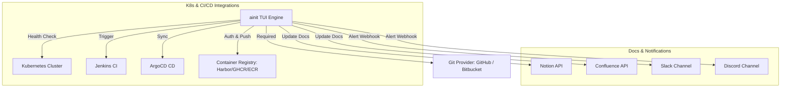
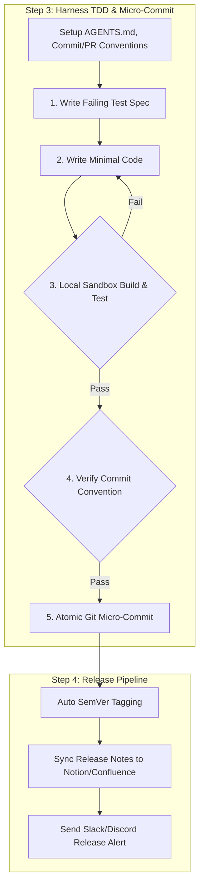

# Agentic-Init (`ainit`)

> Interactive TUI Harness Engineering Tool for Project Initialization, Architecture Design, Commit/PR Conventions, and Automated Release Pipeline.

[](LICENSE)
[](https://go.dev/)

---

## 🚀 Overview

**Agentic-Init (`ainit`)**은 프로젝트의 **Initialization(초기 설계)**부터 **Release(상용 배포)**까지의 전체 개발 생애주기를 관장하는 CLI/TUI 하네스 엔지니어링 도구입니다.

- **바이너리 커맨드 명**: `ainit`

---

## 📖 User Manual & Keybindings (사용 설명서 & 조작법)

### ⌨️ Keybindings (키보드 조작 가이드)

| Key | Description |
| :--- | :--- |
| **`Tab` / `→`** | 다음 Step으로 이동 (Step 0 $\rightarrow$ Step 4) |
| **`Shift+Tab` / `←`** | 이전 Step으로 이동 |
| **`↑` / `↓` (`k` / `j`)** | Step 내부 폼 항목 간 위/아래 포커스 이동 |
| **`Enter` / `Space`** | 옵션 값 변경, 토글 선택, 또는 Health Check 실행 |
| **`Ctrl+C` / `q`** | TUI 도구 안전 종료 및 설정 저장 |

---

### 💡 Step-by-Step User Guide (단계별 사용 가이드)

#### Step 0: AI Licensing & Provider Setup
1. `Licensing Mode`에서 구독형(Device Flow) 또는 Direct API Key 입력을 선택합니다.
2. 메인 AI 모델(`Primary Model`: Claude 3.5 Sonnet 등)과 토큰 한도 초과 시 사용할 `Fallback Model`을 지정합니다.

#### Step 1: Architecture Spec & Mermaid Diagrams
1. `Project Name`을 입력하고 아키텍처 스타일(MSA, Modular Monolith, EDA)을 고릅니다.
2. Sequence Diagram, Traffic Flow, GitOps Flow, ERD 등의 자동 생성 토글을 설정합니다.
3. 소스코드 레이아웃(Monorepo vs Multirepo)을 선택합니다.

#### Step 2: MCP Tooling & Infrastructure Connections
1. 필수 항목인 Git Provider(GitHub 또는 Bitbucket)를 연결합니다.
2. Kubernetes context, Jenkins CI, ArgoCD CD, Container Registry 정보를 구성하고 `Health Check` 버튼을 눌러 연결을 확인합니다.
3. Documentation(Notion/Confluence) 및 Alert Webhook(Slack/Discord) 채널을 지정합니다.

#### Step 3: Harness TDD, Commit & PR Conventions
1. **Commit Convention**: Conventional Commits, Gitmoji, Issue Prefix 또는 Custom Regex 중 원하는 커밋 메시지 규칙을 고릅니다.
2. **PR Convention**: Pull Request 템플릿과 자동 체크리스트(Unit test, API Spec, Security Scan)를 설정합니다.
3. **TDD Mode**: 실패하는 Unit Test 우선 작성을 유도하고 로컬 샌드박스 빌드 검증 후 커밋되도록 지정합니다.

#### Step 4: Release & Deployment Pipeline
1. SemVer 기반 자동 버전 태깅 규칙을 정합니다.
2. 배포 완료 시 Notion/Confluence 변경이력 자동 동기화 및 Slack/Discord 배포 알림 훅을 가동합니다.

---

## 🛠️ Build & Installation Guide (빌드 및 설치 방법)

### Prerequisites (사전 요구사항)
- **Go**: `1.21` 버전 이상 설치 필요 ([Go 설치 가이드](https://go.dev/doc/install))

### 1. Repository Clone & Build
```bash
git clone https://github.com/myeong-han/ainit.git
cd ainit

# 바이너리 빌드
go build -o bin/ainit ./cmd/ainit
```

### 2. Run TUI (TUI 도구 실행)
```bash
./bin/ainit
```

---

## 📋 System Architecture Diagrams

### 1. Overall 5-Step Pipeline Overview


### 2. Step 0 & 1: AI Licensing & Architecture Spec Flow


### 3. Step 2: MCP & Infrastructure Tooling Topology


### 4. Step 3 & 4: Harness TDD Loop & Release Pipeline


---

## 📄 Documentation

- [Detailed User Manual (사용자 종합 설명서)](docs/USER_MANUAL.md)
- [Architecture Design Specification](docs/ARCHITECTURE.md)
- [TUI Questionnaire Form Specification](docs/QUESTIONNAIRE_SPEC.md)

---

> Maintained by **myeong-han**
