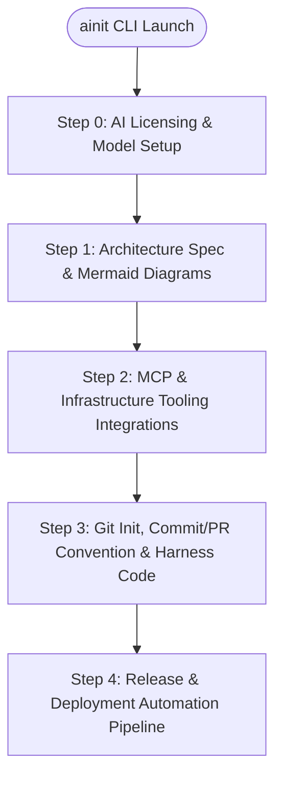

# Agentic-Init (`ainit`) Architecture Specification

## Overview
**Agentic-Init (`ainit`)** is an interactive TUI harness engineering tool that manages the entire lifecycle of a software project from architecture design to release.

## Pipeline Architecture

## Detailed Steps

### Step 0: AI Licensing & Provider Layer
- Support for subscription-based auth (Device Flow) and direct API keys.
- Real-time token and cost estimation tracker.

### Step 1: Architecture & Diagram Generation
- Microservices (MSA), Modular Monolith, or EDA architecture selection.
- Automatic Mermaid diagram generation for Sequence, Traffic Flow, GitOps, and ERD.

### Step 2: MCP Connections
- GitHub and Bitbucket repository management.
- Kubernetes cluster health checking and remote context loading.
- Jenkins CI & ArgoCD CD pipeline integration.

### Step 3: Git Initialization & Commit/PR Conventions
- Automatic rule generation (`AGENTS.md`, `CLAUDE.md`, `.cursorrules`).
- Custom commit conventions (Conventional Commits, Gitmoji, Issue prefix).
- Custom PR templates, checklist rules, and auto-labeling.

### Step 4: Release Pipeline
- SemVer tagging and changelog generation.
- Notion/Confluence release page sync and Slack/Discord notification webhooks.
