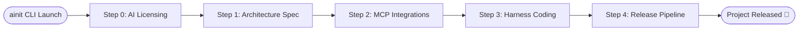
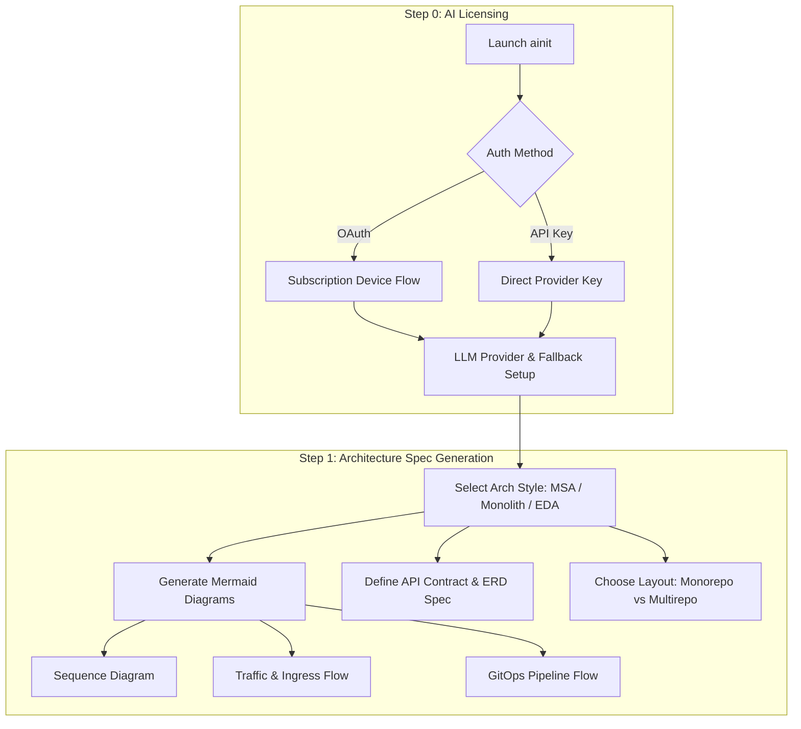
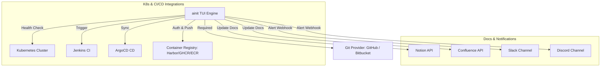
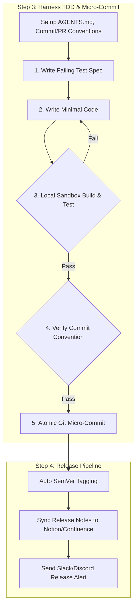

# Agentic-Init (`ainit`) Architecture Specification

## Overview
**Agentic-Init (`ainit`)** is an interactive TUI harness engineering tool that manages the entire lifecycle of a software project from architecture design to release.

## System Architecture Diagrams

### 1. Overall Pipeline Flow

### 2. Step 0 & 1: AI Licensing & Architecture Design Flow

### 3. Step 2: MCP Integrations Topology

### 4. Step 3 & 4: Harness TDD Sandbox & Release Pipeline

