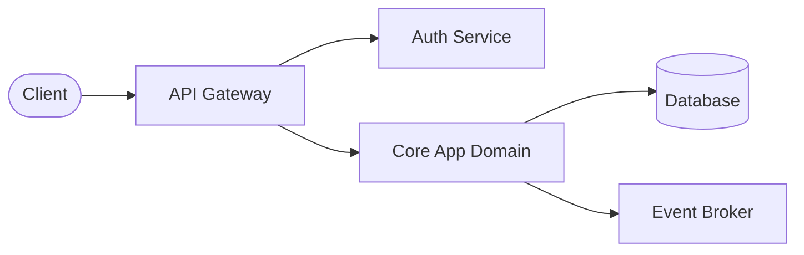
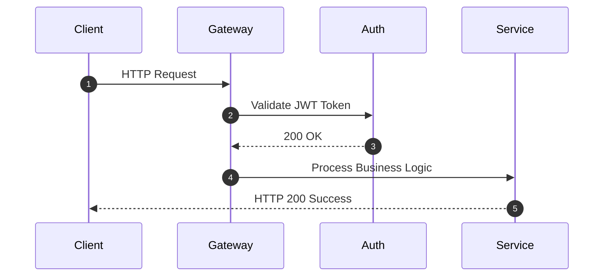
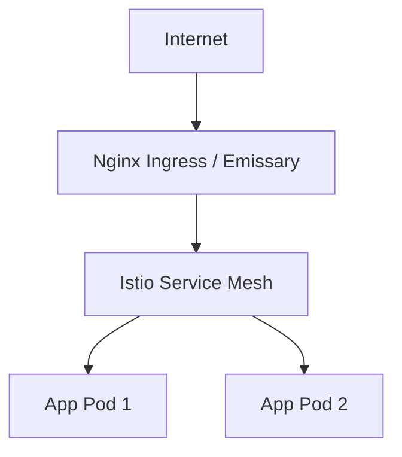
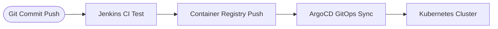

# ainit-project Architecture Specification

## 1. Overview & Requirements
**AI Provider**: anthropic (subscription)
**Primary Model**: claude-3-5-sonnet-20241022
**Architecture Style**: MSA
**Repository Structure**: monorepo

### Plain Text Architecture Prompt Requirements
> Received architecture prompt: '아하'. Press 'Ctrl+S' to generate docs & code.

---

## 2. Generated Mermaid Diagrams

### 2.1 Microservices & Middleware Overview

### 2.2 Sequence Diagram

### 2.3 Ingress Traffic Flow

### 2.4 GitOps & CI/CD Pipeline Flow

---

## 3. Harness Code Strategy
- **TDD Mode**: true
- **Commit Convention**: conventional
- **Local Sandbox Check**: true
